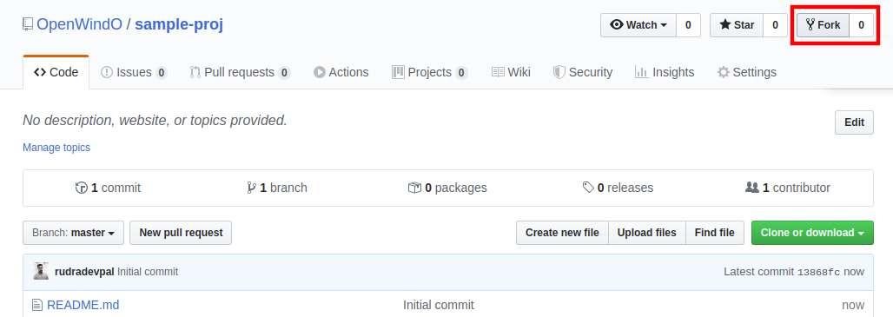
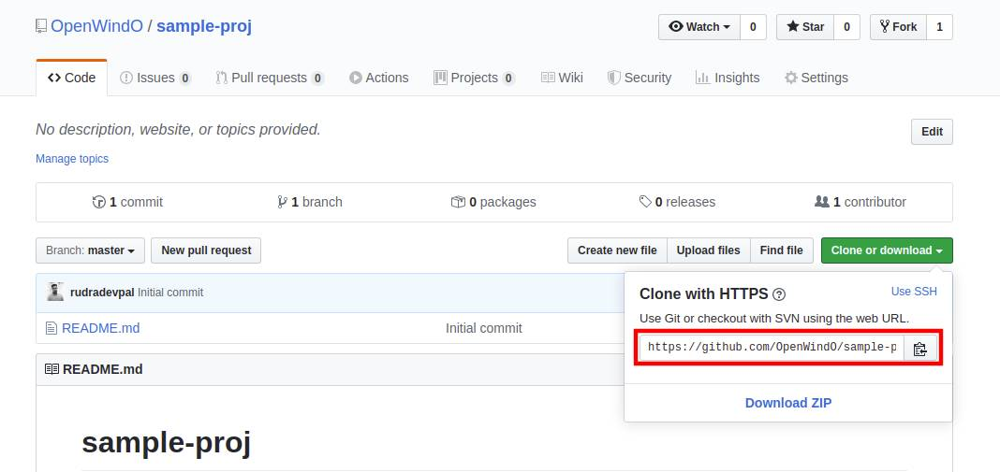
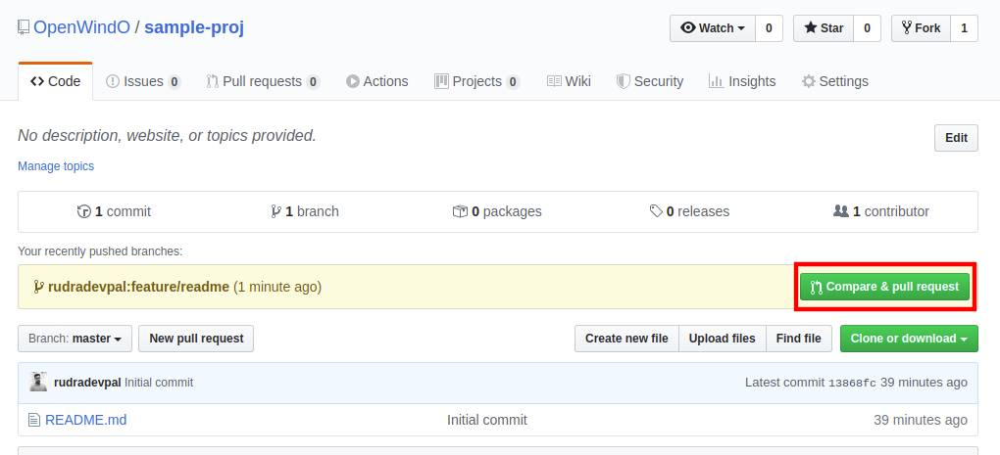
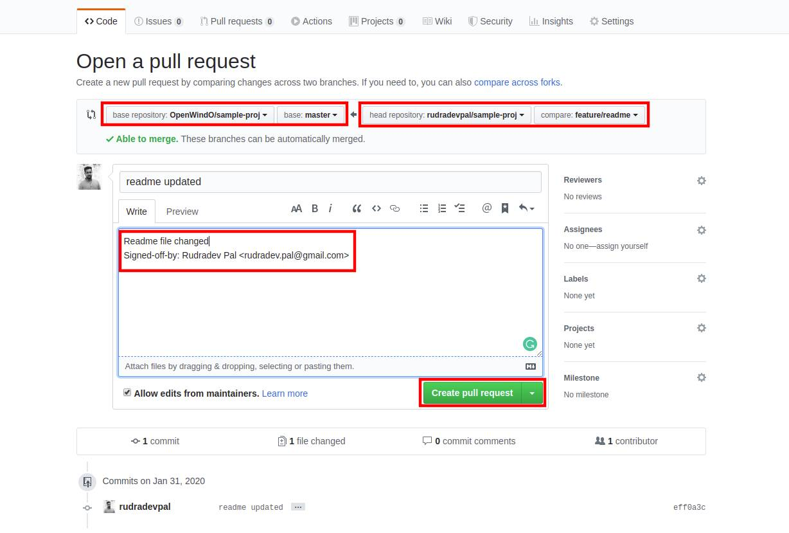

### Start Contributing to windO Project:
To start contributing to windO follow the below steps:

1. Choose component to work one
	You can choose one of the following repositories
	* [windO Docs](https://github.com/OpenWindO/windO-docs) - Markdown, PDF, DOCX
	* [windO Backend](https://github.com/OpenWindO/windO-backend) - Python 3.8.x
	* [windO Agent](https://github.com/OpenWindO/windO-agent) - Python 3.8.x
	* [windO Frontend](https://github.com/OpenWindO/windO-frontend) - Angular 8, Typescript, JavaScript
2. Fork that repository

	
    
3. Copy Git URL
	When you fork a repository you will get the same repository under your github account.
	
	
	
	Open the Repository and copy the URL
	
	

4. Clone Repository
	```sh
	git clone <repository-url>
	```
	```sh
	git clone https://github.com/OpenWindO/sample-proj.git
	```
5. Go inside the cloned repository
	```sh
	cd <repository-dir>
	```
	```sh
	cd sample-proj
	```
6. Create branch for development
	```sh
	git checkout <new-branch-name>
	```
	```sh
	git checkout feature/readme-update
	```
7. Make code changes with your IDE
8. Stage changes
	```sh
	git add .
	```
9. Add commit message and signoff
	```sh
	git -s -m "<commit-message>"
	```
	```sh
	git -s -m "readme file updated"
	```
10. Push the changes
	```sh
	git push origin <branch-name>
	```
	```sh
	git push origin feature/readme
	```
11. Create a pull request

	
	
	
	
